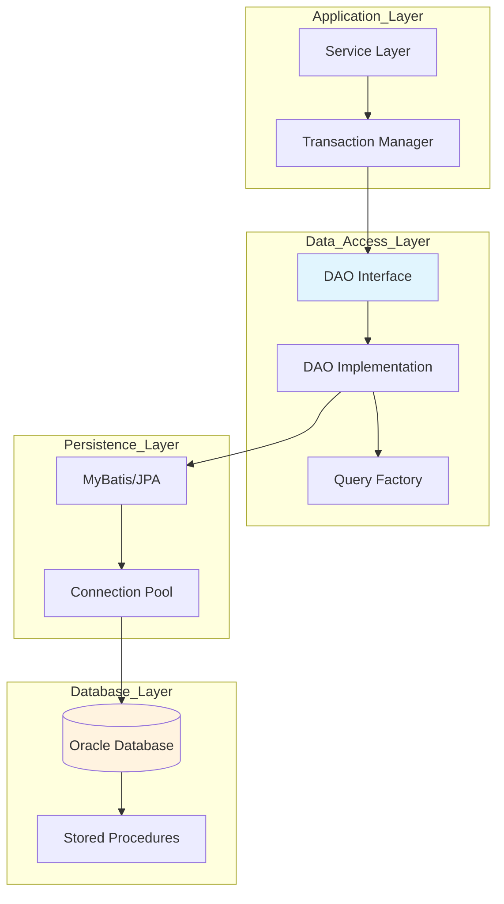

## 1. File: ABBs/data/ABB-DATA-001-oracle-persistence-pattern.md

```markdown
# ABB-DATA-001: Oracle Database Persistence Pattern

## Metadata
```yaml
id: ABB-DATA-001
name: Oracle Database Persistence Pattern
type: ABB
classification: Foundation Building Block
domain: Data Architecture
version: 1.0
status: Approved
owner: Data Architecture Team
created: 2025-01-15
modified: 2025-01-15
tags: [oracle, persistence, database, dao]
```

### 2. **Overview Section**
```markdown
## Overview
This ABB defines the standard pattern for implementing data persistence using Oracle Database in enterprise applications. It provides guidelines for data access, transaction management, and performance optimization.
```

## 3. Architecture Diagram


### 4. **Components Section**
```markdown
## Components

### Data Access Object (DAO) Layer
```java
// DAO Interface
public interface StaffOrgDAO {
    StaffUser findByStaffId(String staffId);
    List<StaffUser> findByDepartment(String deptId);
    void updateStaffInfo(StaffUser staff);
    void insertStaffUser(StaffUser staff);
}

// DAO Implementation
@Repository
public class StaffOrgDAOImpl implements StaffOrgDAO {
    @Autowired
    private SqlSessionTemplate sqlSession;
    
    @Override
    public StaffUser findByStaffId(String staffId) {
        return sqlSession.selectOne("StaffOrgMapper.findByStaffId", staffId);
    }
}

### MyBatis Mapper Configuration
<!-- StaffOrgMapper.xml -->
<mapper namespace="StaffOrgMapper">
    <resultMap id="StaffUserResult" type="com.company.model.StaffUser">
        <id property="userId" column="USER_ID"/>
        <result property="staffId" column="STAFF_ID"/>
        <result property="userName" column="USER_NAME"/>
        <result property="department" column="DEPT_NAME"/>
    </resultMap>
    
    <select id="findByStaffId" resultMap="StaffUserResult">
        SELECT u.USER_ID, u.STAFF_ID, u.USER_NAME, d.DEPT_NAME
        FROM TB_USER_PROFILE u
        LEFT JOIN TB_DEPARTMENT d ON u.DEPT_ID = d.DEPT_ID
        WHERE u.STAFF_ID = #{staffId}
    </select>
</mapper>

### Connection Pool Configuration
<!-- DataSource Configuration -->
<bean id="dataSource" class="com.zaxxer.hikari.HikariDataSource">
    <property name="driverClassName" value="oracle.jdbc.OracleDriver"/>
    <property name="jdbcUrl" value="${db.url}"/>
    <property name="username" value="${db.username}"/>
    <property name="password" value="${db.password}"/>
    <property name="maximumPoolSize" value="50"/>
    <property name="minimumIdle" value="10"/>
    <property name="connectionTimeout" value="30000"/>
    <property name="idleTimeout" value="600000"/>
</bean>
```


### 5. **Transaction Management Section**
```markdown
## Transaction Management

### Declarative Transaction Configuration
```java
@Service
@Transactional(propagation = Propagation.REQUIRED)
public class StaffOrgServiceImpl implements StaffOrgService {
    
    @Transactional(isolation = Isolation.READ_COMMITTED)
    public void updateStaffInfo(StaffUser staff) {
        // Business logic with automatic transaction management
    }
    
    @Transactional(readOnly = true)
    public StaffUser getStaffInfo(String staffId) {
        // Read-only transaction for better performance
    }
}

```

### 6. **Performance Patterns**
```markdown
## Performance Patterns

### Query Optimization
1. **Use Bind Variables**
```sql
-- Good: Uses bind variable
SELECT * FROM TB_USER WHERE STAFF_ID = :staffId

-- Bad: Concatenated SQL
SELECT * FROM TB_USER WHERE STAFF_ID = 'EMP001'
